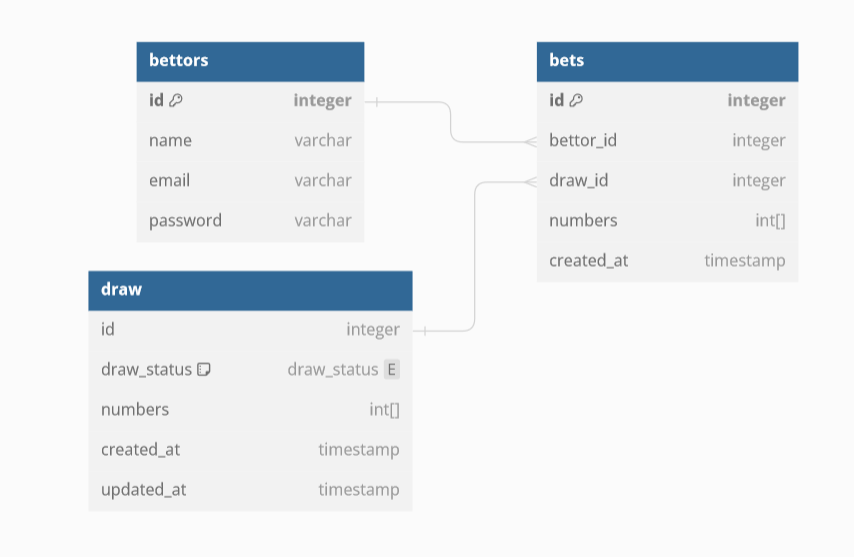

# Mini-Sena

## Description

This is a project that simulates a simple lottery system. It is divided in 4 phases: the betting phase, the drawing phase, the review phase and the awarding phase.

The obejective of this project is to create an API can be accessed to create multiple bets simultaneously by multiple users, using a relational database and creating tests for every feature.

## How to run

Clone the repository:

```
git clone https://github.com/Artituis/Mini-Sena.git
```

Navigate to project directory:

```
cd Mini-Sena
```

Build the application:

```
./gradlew clean build
```

Start the database:

```
docker compose up -d
```

Run the application:

```
./gradlew bootRun
```

## Features

### Login

- [X] Account Creation
- [X] Authentication

### Bets

- [X] Manual bet creation

### Draw

- [X] Drawing numbers
- [X] Multiples draws

### Documentation

- [X] Full swagger documentation

## Technologies

- Spring Boot
- Postgres

## Things I Would Improve

 - Have more tests
 - Finish application deploy

## Database

Using SpringJPA creating the database was simple, and with jakarta validating data was simple.

### Database Schema



## Documentation


## Commit specification

The [Conventional Commits Specification](https://www.conventionalcommits.org/en/v1.0.0/) is used in this repository.

The Commit message should be structured as follows:

    <type>[optional scope]: <description>
    
    [optional body] 
    
    [optional footer(s)]

Recommended types:

    feat:  fix:  build:  chore:  ci:  docs:  style:  refactor:  perf:  test:
